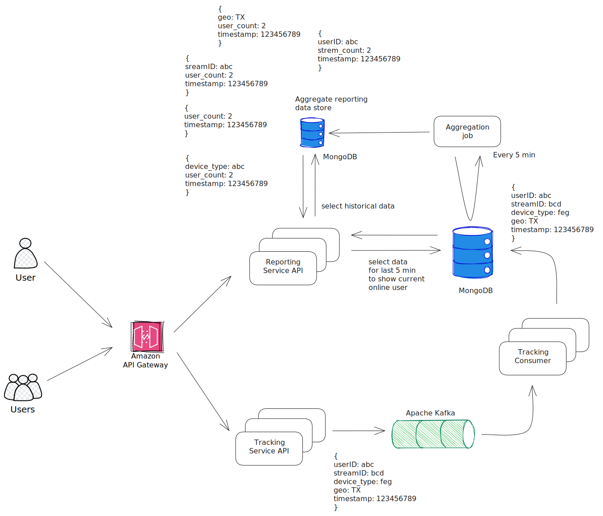
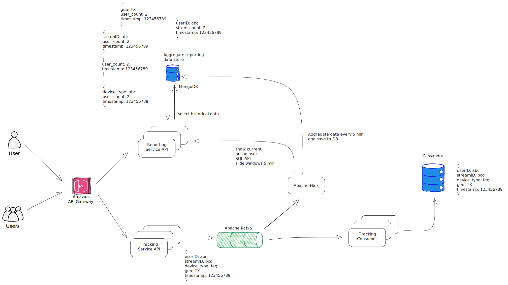

Example project of Real Time Data Processing with Go, Kafka and MongoDB
==========================

In this project, we'll see an example of real-time data processing using Go.


### The Proposed Application for this project

Suppose that we are developing a tool for an internet television service provider. We are tasked to design an Online User Tracking(OUT) system. OUT will be responsible for keeping track of the online viewer count on the different streams/channels available through the service.
(An online viewer is defined as a user who was reported watching a stream at any point during the last 5 minutes)

We are going to develop the API for tracking user activities. The user's devices are going to send the broadcast request the following information for tracking:
- Device Type
- Stream Details
- User/Device Identifier
- USA state detatils

Every broadcast request is published to a Kafka topic. The message that is published to the topic looks like this JSON:

```json
{
    "user_ID" : "38e79e3b-cbd3-4e8d-be7a-d3af3e07ef5e",
    "stream": "abc",
    "device_type": "IPhone 15",
    "geo": "TX",
    "timestamp": "123456789"
}
```

### Here's the General Architecture:


### Run project:
```sh
docker-compose build
docker-compose up -d
```


### The version 2: Kafka + Apache Flink

